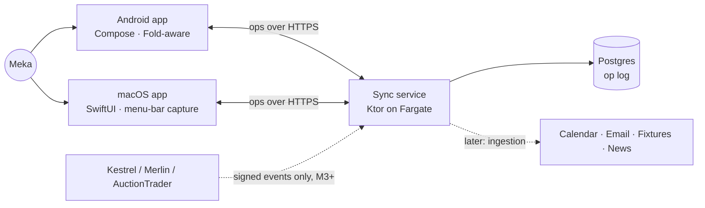
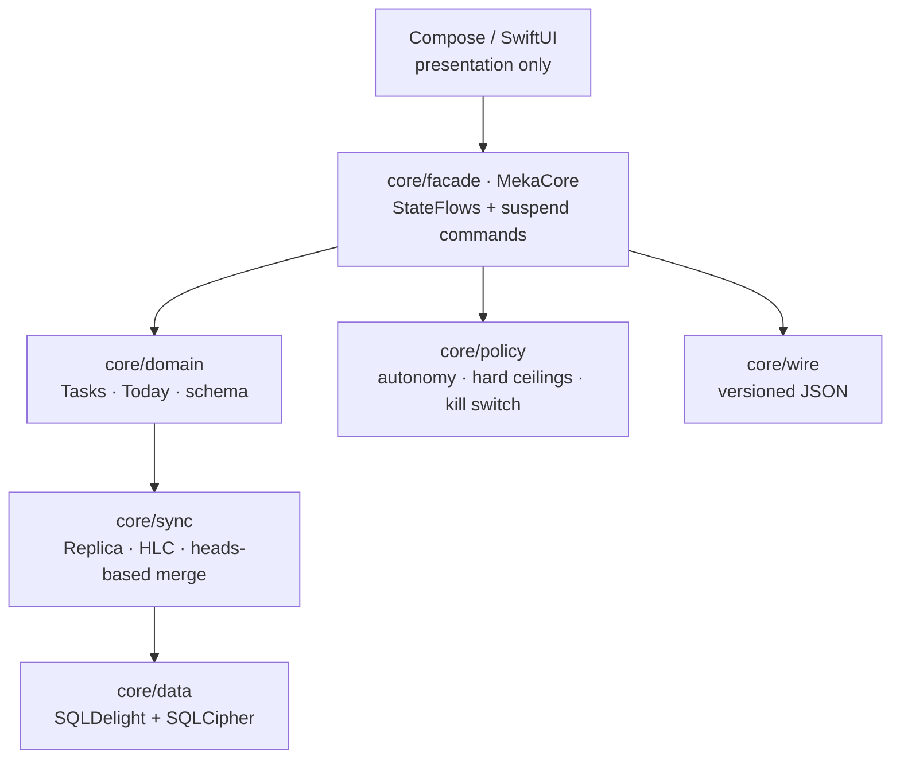

# MEKA OS — architecture and repository plan (M0)

## System context



## Inside each device



Write path: UI → `MekaCore` command → `Tasks` → `Replica.commitLocal` → op appended and field heads updated, in one transaction → `Today` recomputed → push queued.

Read path: SQL → heads per field → merge policy chooses the winner → typed `Task` → `TodayProjection`.

## Sync

```mermaid
sequenceDiagram
  participant A as Android (offline)
  participant S as Sync service
  participant M as Mac
  A->>A: edit → op{id, hlc, baseOpIds}
  Note over A: queued; UI already correct
  A->>S: push(ops) — retried until acked
  S->>S: store once (op_id UNIQUE), assign seq
  M->>S: pull(after = cursor)
  S-->>M: ops[seq…]
  M->>M: apply (idempotent) → same heads → same state
```

## Repository

```
meka-os/
├─ core/
│  ├─ sync/       stdlib-only kernel: Hlc, Op, FieldState/Merge, Replica, SyncService, SyncClient
│  ├─ domain/     stdlib-only: schema + merge policy per field, Tasks, TodayProjection, ids
│  ├─ policy/     stdlib-only: PolicyEngine (ADR-006)
│  ├─ wire/       JSON wire codec (kotlinx-serialization tree API)
│  ├─ testing/    SyncWorld (multi-device + faulty transport), ReplicaStoreContract
│  ├─ data/       SQLDelight schema, SqlReplicaStore, Android/Mac database openers
│  └─ facade/     MekaCore (UI API), HttpSyncTransport, MacCoreFactory (Swift entry)
├─ android/app/   Compose app: Today, detail pane, quick capture, Keystore DB key, WorkManager sync
├─ macos/         SwiftUI app (XcodeGen project.yml), Keychain identity, bridge tests
├─ backend/       Ktor sync API, Postgres op store, device auth, migrations
├─ infra/         AWS CDK stack + invariant tests
├─ design/        tokens.json → generated Kotlin/Swift tokens (+ contrast gate)
├─ tools/         core-verify.sh (offline kernel verification), kotlin.test shim
├─ docs/          ADRs, spikes, this file
└─ .github/       CI
```

## Verification status

CI is `mekaminu/meka-os`, GitHub Actions. All four jobs went green on 2026-10-01.

| Area | Verified by | Status |
|---|---|---|
| Kernel: sync, merge, domain, policy, wire | 47 tests under real `kotlin.test` (CI) and offline (`tools/core-verify.sh`) | ✅ |
| Store contract on real SQLite (`SqlReplicaStore`) | `:core:data:jvmTest` | ✅ |
| Facade: Today flows, offline→online, conflict choices | `:core:facade:jvmTest` and `macosArm64Test` | ✅ |
| Sync API: auth, idempotent push, household isolation; concurrent pushes on Postgres 17 | `:backend:test` with a Postgres service container | ✅ |
| Android app: assemble, unit tests, lint | `android` job | ✅ |
| Kotlin/Native, XCFramework, SwiftUI app, Swift↔Kotlin bridge test | `macos` job (macOS 26, Xcode 26.6) | ✅ |
| Infra invariants and synth; design tokens and contrast gate | `tokens-and-infra` job | ✅ |
| On real devices: Fold fold/unfold, two-device sync against a deployed backend | — | ⏳ Needs the Fold over USB and an AWS account |

## M0 → M1

M0 is done when CI is green on all jobs and the acceptance scenarios pass on real devices:
- Android offline → edit → online
- both devices offline → conflicting edits → reconnect

M1 then adds:
- calendar read (first provider)
- Barcelona fixtures and plan reconciliation
- the deterministic day planner v1
- the notification governor v1
- fasting
- lightweight Goals and Habits
